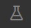
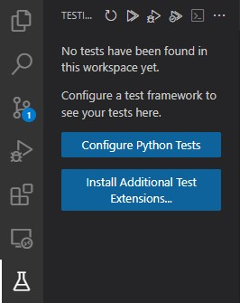
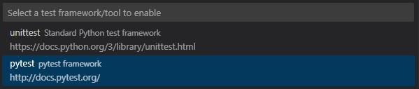
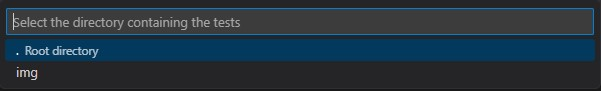
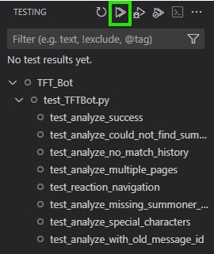

TFT_Bot
=======

A simple Teamfight Tactics (TFT) Discord bot that will accept a ```!analyze SUMMONER_NAME``` command and provide information about the ongoing game or historical data.

### Requirements

* Python 3.12+ (https://python.org)
* Discord Account (https://discord.com)
* Discord Bot (https://discord.com/developers/applications)
    * The Bot needs the **Manage Messages** permission
* Discord Bot Token (https://www.writebots.com/discord-bot-token/)
* Riot API Key  (https://developer.riotgames.com/)

### Installation

1. Create a virtual environment ```python -m venv .venv```
2. Load the environment:
    * ```./.venv/Scripts/activate.bat or ps1``` for Windows
    * ```scource ./.venv/bin/activate``` for Linux
3. Use ```python -m pip install --upgrade -r ./requirements.txt``` to install dependencies

### Setup

1. Create a copy of the ```_envs.py``` file and rename it to ```envs.py```, this file will temporarily set the environment variables
2. In this file you need to replace the ```FILL_ME``` entries with the corresponding values
    * For running the bot the only entries required are: ```DISCORD_TOKEN``` and ```RIOT_API_KEY```
    * For testing ```DISCORD_USER``` and ```DISCORD_PW``` are also required

OR

* You can set the ```DISCORD_TOKEN``` and ```RIOT_API_KEY``` on the system yourself

OR

* you can pass in ```--riot-api-key RIOT_API_KEY``` and ```--discord-token DISCORD_TOKEN``` as arguments

### How to Run

1. Make sure the ```.venv``` is loaded
2. run ```python TFTBot.py```
    * Optionally you can pass in ```--riot-api-key RIOT_API_KEY``` and ```--discord-token DISCORD_TOKEN``` as arguments, this will overwrite environment variables

Testing
-------

### Selenium

#### **Prerequisites**

* **[Optional/Recommended]** VSCode
    * With Python extension installed (https://marketplace.visualstudio.com/items/?itemName=ms-python.python)

#### **Execute Selenium Tests**

##### Setup

If you have filled out **ALL** entries in the ```envs.py``` file you are good to go, else go to [TFT_BOT Setup 2.](#setup)

UI:
1. Make sure you are in the **TFT_BOT** directory
2. Select the **Testing** tab 
    
    

3. Choose the **Configure Python Tests** option

    

4. Select **pytest** as your test framework/tool

    

5. Set the **Root** directory as your rest directory

    

CLI:

1. Make sure you are in the **TFT_BOT** directory
2. Open a terminal and make sure the ```.venv``` is loaded
3. run ```pytest```

##### Run

1. Navigate to the **Testing** tab

    

2. Click the **Run Tests** button to run all the tests

    

**Note:** During the initial run it might be that Discord will prompt for a Captcha. Please be aware and solve it.

### Postman

#### Prerequisites

* npm (https://nodejs.org) (npm comes bundled with nodeJS)

#### Installation

* Use ```npm install -g newman``` to install newman

#### Run Postman collection

1. Make sure you are in the **TFT_BOT** directory
2. Execute ```python postman.py```, this will run the Postman collection to verify the Riot API works